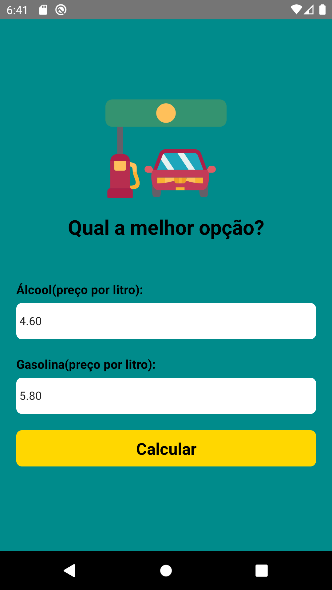
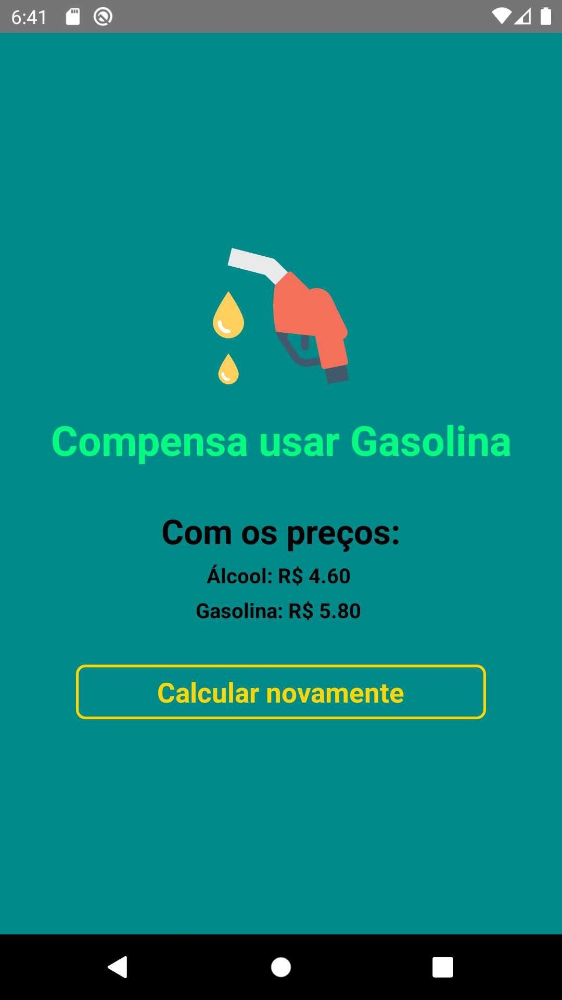

# APP CÁLCULO DE COMBUSTÍVEL COM REACT-NATIVE

Neste app foi usado um Modal, onde na primeira tela é inserido o preço do álcool e da gasolina, e na tela do modal é mostrado o preço dos combutíveis e uma mensagem dizendo qual combustível compensa usar.

